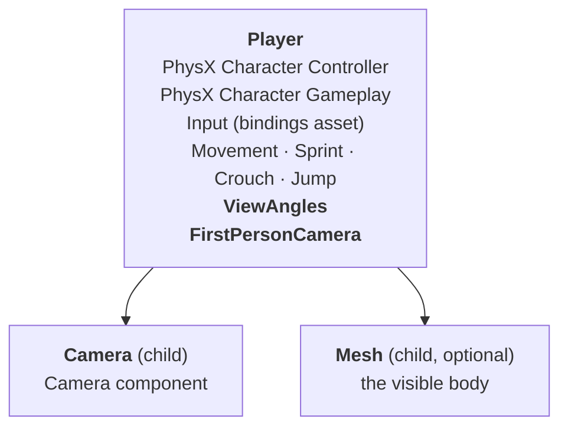
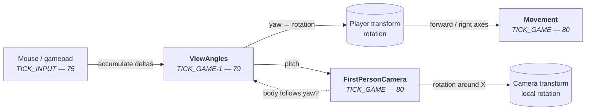

# ModularCharacterController

A first-person character controller for **O3DE 26.05**, split into small components that each own
one thing. Built on the PhysX character controller.

The point of the split is that abilities can be added, removed or replaced without touching the
core, and that a third-person view can later be added without rewriting how looking works.

---

## Components

| Component | Owns | Depends on |
|---|---|---|
| **Movement** | WASD movement, acceleration, speed multiplier channels, capsule geometry, `IsGrounded()` proxy | PhysX Character Controller, Character Gameplay, Input |
| **Sprint** | A speed multiplier on its own channel | Movement, Input |
| **Crouch** | Capsule resize, headroom check before standing, crouch speed multiplier | Movement, Input |
| **Jump** | Jump impulse, coyote time, input buffer, jump cut, head-hit detection, crouch-jump modes | Movement, Input |
| **ViewAngles** | The look direction: yaw and pitch. Reads mouse and gamepad, clamps pitch, rotates the **body** | Input |
| **FirstPersonCamera** | Makes its camera the active view, applies pitch to that camera, answers the body-follow rule | ViewAngles |

### Speed multiplier channels

Sprint and Crouch never set the speed directly. Each writes into its own named channel via
`MovementRequests::SetSpeedScale(AZ::Crc32 channel, float)`, and Movement multiplies all channels
together. Multiplication has a neutral element, so a channel that is not set contributes nothing and
the order of writers does not matter. Every writer resets its channel in `Deactivate()`.

---

## Entity setup

This is the part that is easy to get wrong, and it fails in a way that looks like a code bug.

**Every controller component goes on the Player entity, including FirstPersonCamera.** The camera
lives on a separate child entity that carries only the engine's Camera component, and
FirstPersonCamera's `Camera Entity` field points at it.

Putting ViewAngles or FirstPersonCamera on the camera entity compiles, activates, and *almost*
works: pitch behaves, yaw is computed correctly but never appears. Both components then write the
rotation of the same entity, and the later one overwrites the earlier one every frame.

---

## How a frame flows

Tick order is not decoration. ViewAngles must run **before** Movement, because Movement derives the
world move direction from the body rotation ViewAngles just wrote. Handlers sharing a tick order run
in an unspecified order, so ViewAngles returns `TICK_GAME - 1` explicitly.

---

## Design notes

**The look direction is stored, the body rotation is derived.** ViewAngles keeps yaw and pitch as
numbers; the body's rotation is written from yaw each frame, absolutely rather than incrementally.
The alternative — treating the transform as the master and rotating it by a delta — works only while
body yaw and view yaw are the same number, which an orbiting third-person camera breaks. Same shape
as `ControlRotation` in Unreal and `viewangles` in Quake and Source.

The cost: body yaw exists in two places, the master and its reflection in the transform. Anything
else that rotates the body — a teleport, a cutscene, root motion later — has to write into
ViewAngles, or the next frame will undo it.

**ViewAngles never touches a camera.** It owns numbers and the body rotation, nothing else. A view
component reads the pitch and decides what it means: first person tilts the camera in place, an
orbiting third-person view would move it along an arc around the character. Same number, different
geometry — which is why applying it belongs to the view component.

**Input is read by ViewAngles, not by the view components.** Look angles have to keep working with no
view component active at all: a dedicated server, a remote player, an AI character.

**Mouse and stick are different signals.** A mouse delta is an increment — it accumulates and must
not be scaled by `deltaTime`. A stick value is a rate — the latest value wins and it must be scaled
by `deltaTime`. They also use different units: degrees per unit of delta (~0.1) versus degrees per
second (~150). One field cannot serve both, which is why there are four look input events and two
pairs of sensitivities.

**Who owns the child camera's transform.** Rotation belongs to the view component. The local
*translation* is reserved for a future owner of the eye position, which will sum the crouch offset,
head bob and landing dip. That is why the code uses `SetLocalRotationQuaternion` and never
`SetLocalTM`.

---

## Input bindings

The Input component on the Player needs a `.inputbindings` asset with these events:

| Event | Input | Map type |
|---|---|---|
| `Forward` `Back` `Left` `Right` | movement keys | `InputEventMap` |
| `Jump` `Sprint` `Crouch` | action keys | `InputEventMap` |
| `LookMouseX` | `mouse_delta_x` | `InputEventMap` |
| `LookMouseY` | `mouse_delta_y` | `InputEventMap` |
| `LookStickX` | right stick X | `ThumbstickInputEventMap` |
| `LookStickY` | right stick Y | `ThumbstickInputEventMap` |

Mouse and stick need **separate events**: the callback receives only a `float`, so the device cannot
be identified from the value, and the two need opposite handling.

Use `ThumbstickInputEventMap` for the stick — it provides inner and outer dead zones, a per-axis dead
zone and a sensitivity exponent, so stick drift and the response curve are handled by the binding
asset rather than by this gem.

---

## Building

The gem does not build on its own — `ly_add_target` needs the parent project's CMake context. Open
the **project** folder in the IDE, not the gem folder.

Targets that use `CameraBus.h` need `AZ::AzFramework` in their `BUILD_DEPENDENCIES`. Targets do not
inherit dependencies from each other, so it has to be added to each one that needs it.

When adding a file: list it in `modularcharactercontroller_private_files.cmake` (or
`..._api_files.cmake` for a public header in `Include/`), register the component descriptor in
`ModularCharacterControllerModuleInterface.cpp`, then reconfigure CMake.

A gem is a DLL and is not hot-reloaded. Close the editor before building, or the link step fails with
`LNK1168` while the rest of the build still reports success. If a change seems to have no effect,
compare the timestamp of the built DLL against the source file before debugging anything else.

---

## Status

Movement, Sprint, Crouch and Jump are complete and tested in game. ViewAngles and FirstPersonCamera
work. Not yet built: the owner of the eye position (crouch offset, head bob, landing dip) and the
third-person view with runtime switching.
