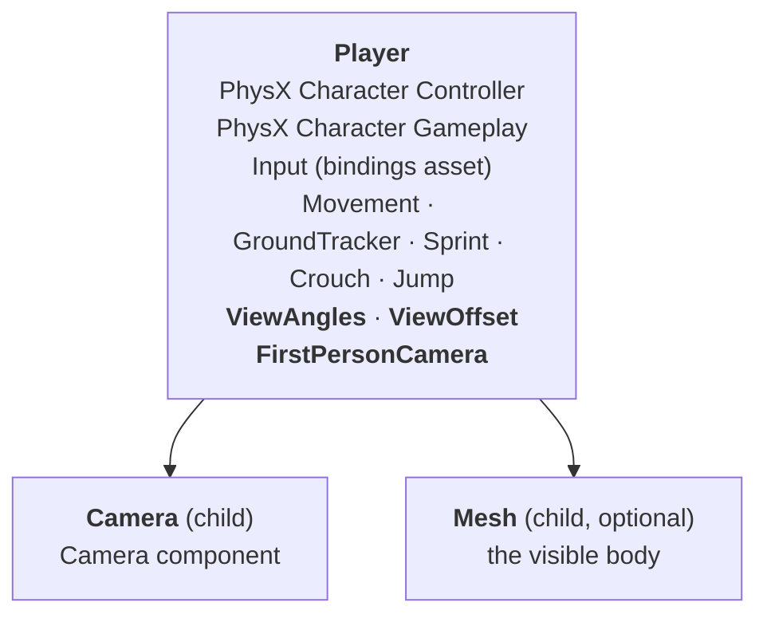
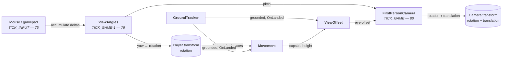

# ModularCharacterController

A first-person character controller for **O3DE 26.05**, split into small components that each own
one thing. Built on the PhysX character controller.

The point of the split is that abilities can be added, removed or replaced without touching the
core, and that a third-person view can later be added without rewriting how looking works.

---

## Components

| Component | Owns | Depends on |
|---|---|---|
| **Movement** | WASD movement, acceleration and braking, speed multiplier channels, capsule geometry, which collision group counts as solid | PhysX Character Controller, Character Gameplay, Input |
| **GroundTracker** | Whether the character is on the ground, how long it has been off it, and the landing event with its impact speed | PhysX Character Gameplay |
| **Sprint** | A speed multiplier on its own channel | Movement, Input |
| **Crouch** | Capsule resize, headroom check before standing, crouch speed multiplier | Movement, Input |
| **Jump** | Jump impulse, coyote time, input buffer, jump cut, head-hit detection, crouch-jump modes | Movement, GroundTracker, Input |
| **ViewAngles** | The look direction: yaw and pitch. Reads mouse and gamepad, clamps pitch, rotates the **body** | Input |
| **ViewOffset** | Where the eye sits relative to its authored position: crouch offset, head bob, landing dip, summed into one delta | Movement, GroundTracker |
| **FirstPersonCamera** | Makes its camera the active view, applies pitch and the view offset to that camera, answers the body-follow rule | ViewAngles, ViewOffset |

### Speed multiplier channels

Sprint and Crouch never set the speed directly. Each writes into its own named channel via
`MovementRequests::SetSpeedScale(AZ::Crc32 channel, float)`, and Movement multiplies all channels
together. Multiplication has a neutral element, so a channel that is not set contributes nothing and
the order of writers does not matter. Every writer resets its channel in `Deactivate()`.

### Levels and edges

GroundTracker exists because two different kinds of question need two different answers. *Am I on
the ground* can be asked at any time, so it is a getter. *I have just landed, this hard* describes
an instant, and the value that describes it is already destroyed by the time anyone could ask — the
engine zeroes the falling velocity the moment it sees ground. A value that cannot be asked for later
has to be pushed, which is what the notification bus is for.

GroundTracker measures and does not judge. It reports every landing, including stepping off a kerb.
Which of them deserve a reaction is the consumer's decision: footstep audio wants all of them, the
camera dip wants a threshold, fall damage wants a much higher one.

---

## Entity setup

This is the part that is easy to get wrong, and it fails in a way that looks like a code bug.


```mermaid
graph TD
    P["<b>Player</b><br/>PhysX Character Controller<br/>PhysX Character Gameplay<br/>Input (bindings asset)<br/>Movement · GroundTracker · Sprint · Crouch · Jump<br/><b>ViewAngles</b> · <b>ViewOffset</b><br/><b>FirstPersonCamera</b>"]
    C["<b>Camera</b> (child)<br/>Camera component"]
    M["<b>Mesh</b> (child, optional)<br/>the visible body"]
    P --> C
    P --> M
```

**Every controller component goes on the Player entity, including FirstPersonCamera.** The camera
lives on a separate child entity that carries only the engine's Camera component, and
FirstPersonCamera's `Camera Entity` field points at it.

Putting ViewAngles or FirstPersonCamera on the camera entity compiles, activates, and *almost*
works: pitch behaves, yaw is computed correctly but never appears. Both components then write the
rotation of the same entity, and the later one overwrites the earlier one every frame.

### Capsule proportions

Crouch resizes the capsule, and the dimensions have to leave it room to shrink:

```
2 × Radius  <  Crouch Height  <  Height
```

Working values: Height 1.8, Radius 0.35, Crouch Height 1.0. The child camera's authored Z must match
the capsule — around 1.37 for a 1.8 capsule.

A `Crouch Height` equal to `Height` is the failure that costs an evening: crouching still toggles,
the speed multiplier still applies, and the capsule never changes size. The headroom check then
sweeps a distance of zero and passes unconditionally.

---

## Project setup

The gem works with no project configuration at all. This section is about one optional thing.

**Movement has a `Solid Collision Group` field** that tells the gem's own queries — today only the
headroom check before standing up — what counts as solid. Leave it empty and they collide with
everything, which is the correct answer for a project that has nothing to exclude.

Set it once the level gains geometry the character must walk on but must not see from those checks:
an invisible ramp laid over a staircase is the usual case, since the PhysX controller steps *up*
onto ledges but has no step-down snapping and treats a descending stair as a short fall. Create the
collision layer and the group in `Tools` → `PhysX Configuration` → `Collision Filtering`, put the
clip geometry on the new layer, and select a group that contains everything *except* that layer.

**Collision layers cannot ship with a gem.** A layer is a numbered slot in a fixed 64-entry table,
so two gems that each needed one would claim the same slot and there is no rule that would merge
them. This is why the gem only ever *reads* a group and never assigns a layer to anything: a gem
that reads degrades to "collide with everything", which is still correct, while a gem that assigns
would put its colliders on `Default` and misbehave silently.

If the field points at a preset that has since been deleted, Movement says so once at activation.
It stays quiet when the field is simply empty — that is a valid state, and a warning that fires in
every correctly configured project is one that stops being read.

---

## How a frame flows


```mermaid
graph LR
    IN["Mouse / gamepad<br/><i>TICK_INPUT — 75</i>"]
    VA["<b>ViewAngles</b><br/><i>TICK_GAME-1 — 79</i>"]
    FPC["<b>FirstPersonCamera</b><br/><i>TICK_GAME — 80</i>"]
    GT["<b>GroundTracker</b>"]
    MOV["<b>Movement</b>"]
    VO["<b>ViewOffset</b>"]
    PT[("Player transform<br/>rotation")]
    CT[("Camera transform<br/>rotation + translation")]

    IN -->|"accumulate deltas"| VA
    VA -->|"yaw → rotation"| PT
    PT -->|"forward / right axes"| MOV
    GT -->|"grounded, OnLanded"| MOV
    GT -->|"grounded, OnLanded"| VO
    MOV -->|"capsule height"| VO
    VA -->|"pitch"| FPC
    VO -->|"eye offset"| FPC
    FPC -->|"rotation + translation"| CT
```

Tick order is not decoration. ViewAngles must run **before** Movement, because Movement derives the
world move direction from the body rotation ViewAngles just wrote. Handlers sharing a tick order run
in an unspecified order, so ViewAngles returns `TICK_GAME - 1` explicitly.

**Known debt:** GroundTracker, Movement and ViewOffset do not override `GetTickOrder()` and all sit
at `TICK_DEFAULT` (1000), which is *later* than FirstPersonCamera at `TICK_GAME` (80). The camera
therefore shows the previous frame's offset, and the relative order of the three is undefined. Every
value involved is smoothed, so the lag is invisible today — but it is unassigned, not correct.

---

## Design notes

**The look direction is stored, the body rotation is derived.** ViewAngles keeps yaw and pitch as
numbers; the body's rotation is written from yaw each frame, absolutely rather than incrementally.
The alternative — treating the transform as the master and rotating it by a delta — works only while
body yaw and view yaw are the same number, which an orbiting third-person camera breaks. Same shape
as `ControlRotation` in Unreal and `viewangles` in Quake and Source.

The cost: body yaw exists in two places, the master and its reflection in the transform. Anything
else that rotates the body — a teleport, a cutscene, root motion later — has to write into
ViewAngles, or the next frame will undo it.

**ViewAngles never touches a camera.** It owns numbers and the body rotation, nothing else. A view
component reads the pitch and decides what it means: first person tilts the camera in place, an
orbiting third-person view would move it along an arc around the character. Same number, different
geometry — which is why applying it belongs to the view component.

**Input is read by ViewAngles, not by the view components.** Look angles have to keep working with no
view component active at all: a dedicated server, a remote player, an AI character.

**Mouse and stick are different signals.** A mouse delta is an increment — it accumulates and must
not be scaled by `deltaTime`. A stick value is a rate — the latest value wins and it must be scaled
by `deltaTime`. They also use different units: degrees per unit of delta (~0.1) versus degrees per
second (~150). One field cannot serve both, which is why there are four look input events and two
pairs of sensitivities.

**Who owns the child camera's transform.** Rotation belongs to the view component, translation to
ViewOffset. FirstPersonCamera captures the camera's authored local position once at activation and
writes `base + offset` absolutely every frame. Reading the current position and adding a delta would
accumulate and send the camera to infinity. That is also why the code uses
`SetLocalRotationQuaternion` and never `SetLocalTM`.

**Each view effect owns its own state; the total is assembled, never accumulated.** The crouch
offset needs a lerp, head bob must not be filtered at all — smoothing a sine shifts its phase and
eats its amplitude — and the landing dip has its own decay. So each keeps a private field and
`ViewOffset` *assigns* their sum once per tick. A single smoothed total would damage every effect to
suit one of them.

**A continuous output must not be gated by a boolean.** Head bob used to be switched off outright
when the character left the ground, and since `isGrounded` flips in a single frame, jumping while
running cut the cycle mid-stride and moved the eye by the full amplitude at once. Every condition
that silences the bob — enabled, grounded, fast enough — now feeds one weight between 0 and 1 that
blends in and out. Anything else that contributes to the camera later, recoil and damage shake
included, wants the same shape.

**Bob phase advances with distance, not time.** One gait cycle per stride length means the cadence
is correct at any speed and any frame rate, with no special case for sprinting. The phase freezes
while the feet are not working and only restarts once the weight has faded to nothing, so the first
step after a landing reads as a step rather than as a continuation.

---

## Input bindings

The Input component on the Player needs a `.inputbindings` asset with these events:

| Event | Input | Map type |
|---|---|---|
| `Forward` `Back` `Left` `Right` | movement keys | `InputEventMap` |
| `Jump` `Sprint` `Crouch` | action keys | `InputEventMap` |
| `LookMouseX` | `mouse_delta_x` | `InputEventMap` |
| `LookMouseY` | `mouse_delta_y` | `InputEventMap` |
| `LookStickX` | right stick X | `ThumbstickInputEventMap` |
| `LookStickY` | right stick Y | `ThumbstickInputEventMap` |

Mouse and stick need **separate events**: the callback receives only a `float`, so the device cannot
be identified from the value, and the two need opposite handling.

Use `ThumbstickInputEventMap` for the stick — it provides inner and outer dead zones, a per-axis dead
zone and a sensitivity exponent, so stick drift and the response curve are handled by the binding
asset rather than by this gem.

---

## Building

The gem does not build on its own — `ly_add_target` needs the parent project's CMake context. Open
the **project** folder in the IDE, not the gem folder.

Targets that use `CameraBus.h` need `AZ::AzFramework` in their `BUILD_DEPENDENCIES`. Targets do not
inherit dependencies from each other, so it has to be added to each one that needs it.

When adding a file: list it in `modularcharactercontroller_private_files.cmake` (or
`..._api_files.cmake` for a public header in `Include/`), register the component descriptor in
`ModularCharacterControllerModuleInterface.cpp`, then reconfigure CMake.

A gem is a DLL and is not hot-reloaded. Close the editor before building, or the link step fails with
`LNK1168` while the rest of the build still reports success. If a change seems to have no effect,
compare the timestamp of the built DLL against the source file before debugging anything else.

When a reflected field is added, a value typed into the Inspector only reaches the running game once
the level or prefab is **saved**. A prefab stores only what differs from the C++ default, so a field
left at its default is absent from the file — that is not a loss, and the file is plain JSON worth
reading when a setting appears not to apply.

---

## Status

Movement, GroundTracker, Sprint, Crouch, Jump, ViewAngles, ViewOffset and FirstPersonCamera all work
in game. ViewOffset covers the crouch offset, head bob and the landing dip.

Not yet built: the third-person view with runtime switching, and any angular camera effect — a
landing nod would carry far more weight than the vertical dip, but it needs the dip's instant onset
replaced by a curve first, and rotation makes a single-frame jump more obvious, not less.

Open: tick orders are unassigned (see above), `ViewOffsetRequests::SetOffset` is declared but does
nothing, so external contributors such as weapon recoil have no route in yet.
